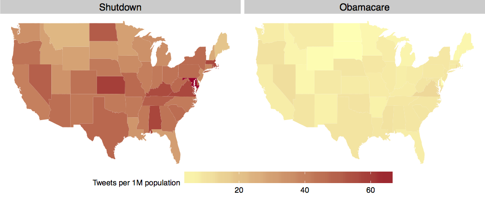
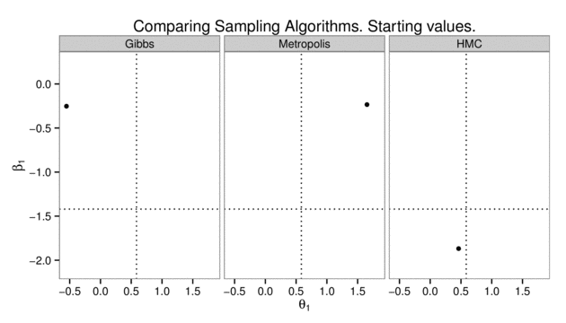

WORKSHOP: Data Visualization with R and ggplot2
--------------

This github repository contains the materials and slides that I prepared for the 2-hour workshop on data visualization with R and ggplot2 organized by the NYU Politics Data Lab in October 2013.

The purpose of the workshop was to introduce ggplot2 as a tool that allows researchers in the social science to easily create elegant and effective graphs. 

It was structured in two parts. First, the R scripts `01_ggplot_basics.R` and `01_scales_axes_legends.R` introduce the grammar of graphics using an analysis of Facebook posts about the government shutdown, extracted using my <a href="https://github.com/pablobarbera/Rfacebook">Rfacebook</a> package for R, as a running example. 

The second part of the workshop focuses on specific applications on the social sciences. `03_line_plots.R`, for example, generates a figure showing the evolution of the unemployment rate in the U.S., similar to the plot on pages 85-97 of the ggplot2 book. `04_coefficients_plots.R` shows how to produce a regression coefficient plots, with confidence intervals, on ggplot2 (shown below).

ggplot2 can also an excellent tools to visualize networks. Using another function from my <a href="https://github.com/pablobarbera/Rfacebook">Rfacebook</a> package, it's easy to show how Facebook personal networks are clustered on communities that overlap with offline behavior (see `05_networks.R`).

Many research articles on the social science rely on maps to visualize geographical information. These maps can also be easily created with ggplot2. Below are two examples that I cover on the workshop: one is a map of Europe with geolocated tweets captured using <a href="https://github.com/pablobarbera/streamR">streamR</a> and colored by language; other is a map of the U.S. comparing the number of tweets mentioning 'shutdown' and 'obamacare' on October 1st, normalized by population. The code to create these plots can be found on `06_maps.R`.

A final example (`07_animated_plots.R`) features a comparison of different Bayesian sampling algorithms applied to an item-response theory model. Using ImageMagick and ffmpeg, it's possible to create animated plots that illustrate the different speeds of convergence.

